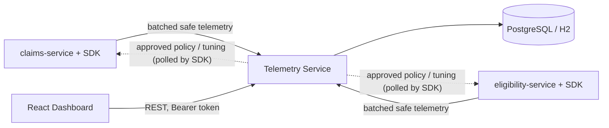

# CATCHY architecture

CATCHY (AcentraCache Insight) has three parts that talk over plain HTTP + JSON.

```
  Acentra Demo Service A (claims-service)        Acentra Demo Service B (eligibility-service)
  uses AcentraCache SDK                          uses AcentraCache SDK
          |  safe telemetry (batched, async)              |
          +---------------------+-------------------------+
                                v
                  AcentraCache Telemetry Service  (:8090)
                  - validates application API keys (X-AcentraCache-Key)
                  - privacy guard: rejects unknown / sensitive fields
                  - stores events + snapshots, aggregates metrics
                  - health scoring, Policy Arena recommendations
                  - role-based APIs, audit log, simulations
                  - control channel: approved policy/tuning -> SDK
                                ^                     |
                                | REST (Bearer)       | PostgreSQL (or H2 locally)
                                |
                  CATCHY React Dashboard (:5173)  ->  authorized Acentra engineer
```



## 1. AcentraCache SDK (`acentra-cache-sdk`)

A plain Java 21 library (only Jackson as a dependency) - no Spring required.

| Type | Role |
|---|---|
| `AcentraCache<K,V>` | one cache **region**: get / put / remove / clear / getOrLoad / metrics / events / policy |
| `CacheRegionConfig` | region name, max entries, max estimated memory, default policy + TTL, risk level, victim cache, SWR, sampling |
| `AcentraCacheManager` | one per application: creates regions, schedules expired-entry cleanup and snapshots, polls approved decisions |
| `CacheKeySanitizer` | salted SHA-256 key fingerprints (or category-only) |
| `CacheMemoryEstimator` | *estimated* entry size (byte[]/String length, JSON length, fallback) |
| `TelemetryClient` | non-blocking telemetry sink; `BatchingHttpTelemetryClient` is the HTTP implementation |
| `CacheHealthEvaluator`, `PolicyAdvisor` | deterministic health scoring and LRU/LFU recommendation (shared with the service) |
| `sim.AccessPatternSimulator` | sample access patterns A-G on real caches with synthetic keys |

### TTL is independent of LRU/LFU

`get`: entry missing -> MISS. Entry present but `expiresAt <= now` -> remove it, count an **expiration** and a MISS, never
return it. Entry present and valid -> HIT, *then* update LRU/LFU metadata. `put`: purge expired entries first (O(log n)
amortised via an expiry min-heap with lazy deletion), then enforce entry and memory limits, and only **then** ask the active
policy for a victim. The eviction policy is never consulted to decide validity.

### LRU and LFU

Both indexes are always maintained, so the policy can be switched at runtime (`changePolicy`) with no rebuild.
* **LRU**: intrusive doubly-linked access-order list; the head is evicted.
* **LFU**: frequency buckets (`TreeMap<freq, list>`); the head of the lowest bucket is evicted, so equal-frequency ties
  resolve to the **least recently used**. Frequency increases only on valid hits (a new entry starts at 0; an overwrite keeps
  the key's frequency).

### Thread safety

One `ReentrantLock` per region guards the map, both indexes, the expiry heap, the victim layer, all counters, the rolling
window, the shadow simulator, the decision log and the policy. It is simple and verifiable (see `ConcurrencyTest`: 12 threads
mixing get/put/remove/cleanUp/clear/policy changes, then invariants: size <= capacity, memory <= limit,
`hits + misses == gets`, `evictions == lru + lfu == entry-limit + memory-limit`). Telemetry publishing inside the lock is a
non-blocking queue `offer`. Single-flight loading uses a `ConcurrentHashMap<key, Refresh>` outside the main lock.

### Memory

`maximumMemoryBytes` is compared against an **estimate** (fixed per-entry overhead + key + value size). It is labelled
*estimated cache memory usage* everywhere and is not JVM heap accounting. When a put would exceed a limit: expired entries are
removed first; then policy victims are evicted until the entry limit and then the memory limit hold. An entry larger than the
whole region limit is rejected (and any older value for that key removed).

### Advanced features (all implemented)

* **Eviction X-ray**: every important action emits a `CacheDecisionEvent` (action, reason, policy, frequency, last-access age,
  remaining TTL, size, cache size and memory before/after, severity). The newest 500 per region are kept locally. HIT/PUT are
  sampled (`routineEventSampling`); MISS, EXPIRED, evictions, policy/config changes, refresh events are never sampled.
* **Victim cache**: entries evicted from L1 move to a small secondary layer (default 15% of L1) **with their original
  expiry** (only if remaining TTL > 0). A miss in L1 that hits the victim layer is a `VICTIM_HIT`, promoted back to L1.
  Metrics: `l1Hits`, `victimHits`, `sourceMisses`, `victimEvictions`, `overallHitRate`. Headline size/memory figures describe L1;
  victim figures are reported separately.
* **Policy Arena**: a `ShadowSimulator` replays the region's read stream (key **hashes** only) through shadow LRU and shadow
  LFU caches of the same effective capacity (read-through, region TTL) over the last 1,000 reads. `PolicyAdvisor` compares them:
  recommend a switch only with >= 100 samples, >= 5 points improvement and no cooldown. **It never switches automatically.**
* **Cache Stampede Shield**: `getOrLoad` is single-flight per key: the first caller loads, concurrent callers wait for that one
  result (counted as `concurrentRequestsCoalesced` / `sourceCallsAvoidedByStampedeShield`). LOW-risk regions may opt into
  stale-while-revalidate (serve the just-expired value while one refresh runs). **HIGH/CRITICAL regions never serve stale data**
  (the config builder rejects the combination) and `requireFreshFromSource` always asks the source and records drift.

## 2. Telemetry service (`telemetry-service`)

Spring Boot 3.5 / Java 21, Spring Data JPA, Flyway, Spring Security. H2 (PostgreSQL mode) by default, PostgreSQL via the
`postgres` profile. Full API in [api.md](api.md).

* **Ingestion**: API-key authentication (keys stored only as SHA-256 hashes), application binding, strict payload validation,
  fail-on-unknown-properties privacy guard, per-key rate limit, size limits.
* **Events vs snapshots**: events are sampled, explainable facts for the X-ray timeline; **snapshots** carry exact cumulative
  counters every ~2 s per region and are the source of truth for aggregation. The service keeps the latest snapshot per
  `(application, region, instance)`, sums across instances, derives timeline deltas (a counter that goes down means a restart).
* **Health**: `CacheHealthEvaluator` (shared with the SDK) with server-side telemetry-age added.
* **Recommendations**: `PolicyAdvisor`, re-evaluated every 15 s; optional Ollama text (disabled by default) only adds
  `aiExplanation` from aggregate numbers.
* **Control channel**: an engineer requests a policy change, another engineer/admin approves; the SDK polls
  `GET /telemetry/control` and applies it, emitting `POLICY_CHANGED` (the request becomes `APPLIED` when a snapshot confirms).
  Admin tuning (max entries/memory/TTL) travels the same way.
* **Audit log**: policy requests/approvals/rejections/applications, configuration changes, API key create/revoke, logins,
  simulation runs, rejected telemetry, access denials.
* **Simulations** run inside the service with real SDK caches and synthetic keys.

## 3. Dashboard (`dashboard`)

React + Vite + TypeScript, plain CSS, hand-written SVG charts, polling every 3 s. Pages: login (demo roles), overview,
projects, applications, regions, region detail (health reasons, charts, Eviction X-ray), Policy Arena, recommendations,
simulations, audit log (ADMIN), configuration (ADMIN). A dev mock mode (`npm run dev:mock`) works without a backend.

## Data model

`project 1-* application_service 1-* application_api_key`; `application_service 1-* cache_telemetry_event`,
`cache_metrics_snapshot`, `cache_policy_recommendation`, `policy_change_request`, `region_config_override`; global
`audit_log_entry`, `user_account`. No table has a column that could hold a raw key or value.

## Key decisions and trade-offs

| Decision | Why |
|---|---|
| Single lock per region | Correct first; a striped design would complicate the LRU/LFU invariants. Contention is measured, not assumed. |
| Both LRU and LFU indexes always maintained | Runtime policy switching and shadow comparison are cheap and exact. |
| Snapshots + sampled events | Exact metrics without one HTTP call (or one database row) per cache read. |
| Approved control channel instead of auto-tuning | Production policy changes need an accountable human. |
| Estimated memory | Honest and cheap; exact retained-heap measurement is not possible portably. |

See the README "Known limitations" for what this MVP deliberately does not do.
